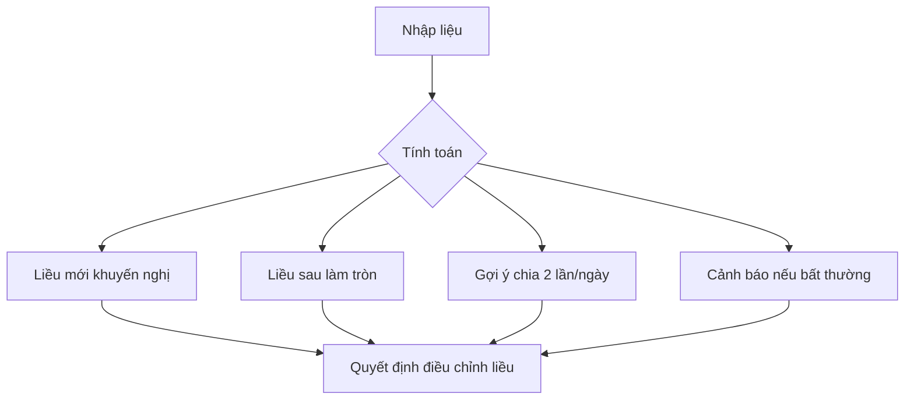

# TDM Tacrolimus Calculator

 

**Máy tính TDM Tacrolimus**

**Ứng dụng tính toán điều chỉnh liều Tacrolimus cá thể hóa dựa trên nồng độ đáy đo được và mục tiêu điều trị.**

---

## Giới thiệu

Tacrolimus là thuốc ức chế miễn dịch quan trọng, cần được theo dõi nồng độ máu (TDM) để tối ưu hiệu quả và giảm độc tính.

Ứng dụng này hỗ trợ:
- Tính toán nhanh liều Tacrolimus mới dựa trên nồng độ đáy đo được.
- Làm tròn liều hợp lý theo dạng viên 0.5mg.
- Gợi ý liều chia 2 lần/ngày nếu cần.
- Cảnh báo tự động khi nồng độ hoặc liều ngoài ngưỡng an toàn.


## Cách sử dụng

### Nhập liệu:
- Tên bệnh nhân
- Tuổi
- Cân nặng
- Liều hiện tại (mg/ngày)
- Nồng độ đáy hiện tại (ng/mL)
- Chọn nồng độ mục tiêu điều trị

### Thực hiện:
- Nhấn nút "Tính toán".

### Xem kết quả:
- Liều mới khuyến nghị
- Liều sau làm tròn
- Gợi ý chia 2 lần/ngày
- Cảnh báo nếu có bất thường


## Sơ đồ quy trình




## Các giá trị nồng độ mục tiêu tham khảo
- Giai đoạn ghép sớm: 8 ng/mL
- Giai đoạn duy trì: 5 ng/mL
- Nguy cơ thải ghép cao: 10 ng/mL


## Triển khai App

### Chạy trên máy tính cá nhân:
```bash
pip install streamlit
streamlit run tdm_tacrolimus_app.py
```

### Deploy Online (Streamlit Cloud):
- Upload file `tdm_tacrolimus_app.py` vào GitHub Repository.
- Đăng nhập [https://streamlit.io/cloud](https://streamlit.io/cloud) bằng GitHub.
- Chọn repository và file, nhấn Deploy.


## Liên hệ
- Người phát triển: Minh Tuấn
- Email: minhtuan.hup@gmail.com

---

> **Ghi chú:** Ứng dụng dành cho mục đích hỗ trợ lâm sàng, khuyến cáo kiểm tra xác nhận với bác sĩ chuyên khoa trước khi áp dụng thay đổi liều.

